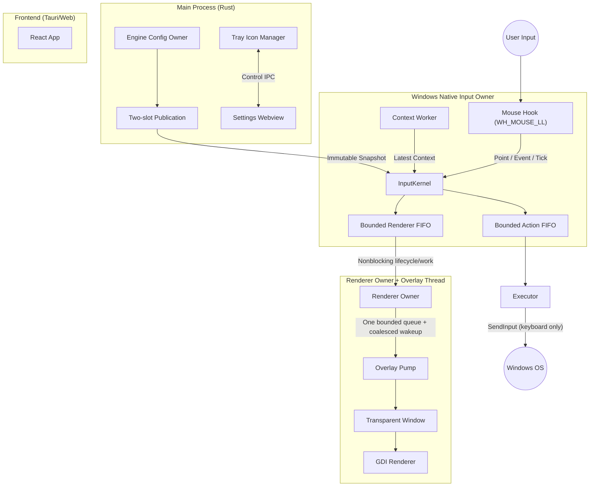

# Zero Gesture Architecture Design Document

> [!NOTE]
> この文書はP05bのWindows Settings control、P04b3c-aまでのmacOS active input・context/action境界、
> P04R3のobjc2 context/action native leafを説明する。
> マルチプラットフォーム目標設計と後続移行ゲートは
> [ADR index](./adr/README.md) を正とする。

## 1. Overview

Zero Gesture は、Windows専用の高性能マウスジェスチャーツールです。
**"Hybrid Native/Web Architecture"** を採用し、設定画面の柔軟性と、常駐時の極限までの軽量化・低遅延を両立させます。

### Core Philosophy

- **Zero-Latency Hook:** マウス入力の監視と遮断は、OSのネイティブAPIを直接叩き、最小限のオーバーヘッドで行う。
- **Native Rendering:** ジェスチャー軌跡（Trail）の描画にはWebviewを使用せず、現行実装はGDIで透明なオーバーレイウィンドウに直接描画する。`direct2d.rs`は常に初期化errorを返す未実装stubである。
- **On-Demand Webview:** 設定画面が必要な時のみWebviewをロードし、通常時はメモリから解放する。

---

## 2. System Diagram



---

## 3. Component Details

### 3.1. Engine Lifecycle and IPC Owner

Tauri main threadがアプリケーションのライフサイクルを管理し、専用IPC owner threadが設定mutationを単一所有します。

- **Responsibility:**
  - Tauriランタイムの初期化。
  - システムトレイ（タスクトレイ）のアイコンとメニュー管理。
  - Engine Config ownerだけが行う設定ファイルの読み書き（Disk I/O）。
  - 設定画面（Webview）の表示/非表示トグル。
  - immutable compiled configを二つの固定slotへ保持し、generation/indexをatomic publishする。Windows native input ownerはidle時にproven reader protocolでsnapshotを取得し、active gesture/action/replayの終了までgenerationをpinする。
  - durable commit/publication後もHook threadを再起動しない。Applied observerはnative ownerの生存だけを確認し、次のidle inputが新generationを読む。owner failureはdiskをrollbackせずEngine全体を終了し、次のbounded restartでcommitted truthを再読込する。
  - Tray labelはApplied後にTauri main threadへ非同期enqueueする。IPC owner threadは同期menu APIを呼ばず、tray自身の変更はApplied受信後にmain thread上でもlabelを整合する。

#### Windows runtime shell

P05aでは同一executableを二つの独立process modeとして維持する。Engineは
current-user singleton、tray、IPC、native input ownerだけを保持し、content
window/WebView2を作らない。SettingsはEngineと共存し、必要時だけ一つのWebViewを
持つ。

Settings builderだけがTauriのautostart pluginとsingle-instance pluginを登録する。
Settingsの成功したsetupは同一exeの`--engine` login起動をenableし、current-user
Run valueを`"absolute executable path" --engine`へ補正してexact readbackする。
pluginと補正backendは同じpackage-derived value nameを使い、変更前のRun/
StartupApprovedをquery/set-value権限だけでsnapshotする。enable/rewrite/read/
mismatch失敗は両valueを元へ戻す。parent key不存在は空のprior stateとして扱い、
registration write時だけ作成する。同時cold launchはSettings専用の短命owner
threadがTauri build前から`RunEvent::Ready`まで保持するbounded current-user
launch mutexで直列化する。mainとの同期は容量1のacquired/release channelだけで、
Ready callbackはrelease signal後すぐreturnし、mutexは同じowner threadが
releaseする。二つ目のSettings起動はTauri/WebView2を作る前に既存receiverへ
bounded転送して終了し、既存windowを
show/unminimize/focusする。
close中にplugin mutexだけが残る場合は新規Settingsを作らずfail closedする。
Settings windowを閉じるとSettings
processとWebView2は終了するが、Engine、hook、IPCは継続する。Engine trayの
left-click/Open Settingsは同一exeを`--settings`で起動し、反復起動も一つの
Settingsへ収束する。Windowsのsingle-instance receiverは、同期WM_COPYDATA
callbackからcross-thread Tauri handle取得をせず、window表示後にWin32で記録した
exact-title/same-process top-level HWNDへ`SW_SHOW`/`SW_RESTORE`をpostする。
記録は同期window列挙をせず`FindWindowW`とPID一致だけで行う。content windowが未生成の
debug-tested caseだけは、WebViewの再入生成を避けるため短命threadからTauri event
loopへ生成を渡す。Quitは
Engine workerを停止してprocessを終了するが、login
autostartを操作するcapabilityを持たない。CIはwindowとWebView2の実process identity
観測後、debug test専用の隔離WebView2 data directoryとsetup完了markerを用いて
production Tauri window closeを駆動し、同じidentityの終了とEngine生存を確認する。
`std::process::exit`による強制終了は使わない。

P05cはcurrent-user NSISだけを配布対象にし、disposable Windows runnerでrelease
installerをsilent installする。実HKCU Run/StartupApproved、single-instance、
既存Settings windowのhide→forward→同一window show/unminimize、
Settingsの実WM_CLOSEとWebView2 tree終了、Engine生存/typed Quit、
Engine PIDの実descendant WebView2不在、missing/wrong acceptance tokenの拒否、
stopped-Engine logのrelative path/byte/hash保持、正常shutdown時のcontrol secret削除、
config sentinel保持、authenticated statusまでのstartup、installed release resource
KPIを検証する。
running-app uninstallのguarded cancellationはprogram/autostartを保持し、成功した
uninstallのpost hookだけがdangling Run/StartupApprovedを削除する。成功後は
package registration、registered uninstaller、installer-owned program directoryの
不在も確認し、disposable cleanupはexact test-owned directory以外を削除しない。
production Windows callback core（capture判定→NativeInputOwner→wakeup disposition）
は100,000 eventのallocation 0、固定lane上限、fail-openをwall-clock非依存でgateする。
CI署名はdisposable self-signedであり、実publisher Authenticodeと
Explorer/physical inputはrelease blockerとしてtruthfulに残す。
順序とruntime境界は[ADR 0019](./adr/0019-windows-first-runtime-shell.md)、
配布契約は[ADR 0021](./adr/0021-windows-nsis-installed-acceptance.md)を正とする。

#### Windows Settings control

P05bではSettings command failureを`code`、`operation`、`retryable`、
任意の`current` observationを持つ内部typed objectへ統一する。UIはmessageを
parseせずcodeでrevision conflict、Engine unavailable/disconnected、validation、
rejected input、filesystem、platform、backend failureを表示する。conflict時は
Engineのcurrent revision/configをquery cacheへ反映するがdirty draftは保持し、
retryだけが新revisionを使う。Applied成功（Importを含む）はEngine observationで
base/draft/currentを置換する。schema v2は変更せず、
`durability_warning`も成功結果として表示する。

window captureはSettings processの別hook/eventを持たない。protocol v3の
Begin/Poll/Cancelは`capture_id`とEngineの単調`epoch`を必須にし、各操作を短い
authenticated Named Pipe sessionで行うためPending中も他controlを占有しない。
App edit routeは一つのcontrollerを三consumerへ共有する。既存Engine
callbackはreal left-downでatomic phase CASとraw point格納だけを行う。window/app/
class/title解決、IPC、ログ、2秒leaseの50 ms sweepはcallback外で行い、
replace/cancel/lease expiry/shutdown後のstale epochを返さない。metadataはfieldごとに4 KiB UTF-8境界で検証し、
macOSは共有protocolをcompileするだけでcapture capabilityを広告しない。詳細は
[ADR 0020](./adr/0020-engine-owned-windows-settings-control.md)を正とする。

### 3.2. Hook Thread (The "Sensor")

UIスレッドのブロックを防ぐため、独立したスレッドでマウス入力を監視します。

- **Technology:** `windows-sys` crate (Win32 API: `SetWindowsHookExW`, `CallNextHookEx`)
- **Responsibility:**
  - **Low-Level Mouse Hook:** `WH_MOUSE_LL` を使用してマウスイベントをフック。
  - **Event Suppression:** ジェスチャー開始トリガー（例: 右クリック）を検知した場合、OSへのイベント伝播をブロック（`1`をreturn）し、コンテキストメニューの出現を防ぐ。
  - **Gesture Recognition:** マウスの移動ベクトルを計算し、定義されたジェスチャー（例: `Right` -> `Down`）と照合する。
  - **Input owner:** callbackは`MSLLHOOKSTRUCT`のpoint/event/tickを`InputKernel`へ渡し、二slot readerの固定atomic操作と固定長lane reservationだけでpass/suppressを同期決定する。allocation、lock、blocking send、IPC/JSON、log、file I/O、OS query、thread生成、Tauri/WebView callを行わない。
  - **Context Resolution:** callback外のContext workerが`GetCursorPos`、`WindowFromPoint`、window/process情報、app matchingを事前解決し、一つのlatest-value mailboxへgeneration/binding/target/point/tickを公開する。exact point、100 ms以内、same generationを満たさないtriggerはfail-openでpassする。
  - **Communication:** callbackはaction 16件、renderer 64件の独立した固定長FIFOへnumeric workだけをenqueueする。renderer point/labelはoverload時にdropできるが、callback lane、renderer-owner ingress、overlay ingressの各queueがstartからendまで一つのterminal slotを予約する。
  - **Action:** target activation、keyboard action、trigger replayは同じaction FIFOをHook Threadのmessage loopがcallback復帰後に実行する。activation resultとinjection/completion failureは`InputKernel`へ戻す。
  - **Readiness/Fatal:** Hook thread IDは`SetWindowsHookExW`とsafety timerの成功後にだけreadyとして公開する。message loopはcontext/renderer ownerの終了を継続監視し、予期しない終了ではsuppressionを解除してEngineをnonzero終了する。

### 3.2.1. macOS Event Tap Owner

macOS Engineは専用native threadでsuppress-capable `CGEventTap`と`CFRunLoop`を
所有する。P04b2ではlisten-only tapとして導入し、context、`InputKernel`、
抑止/replay、action、rendererへ接続しなかった。Listen Event permissionのpromptも
Engineから表示せず、後続Settings UIへ委ねる。

P04b3aでは後続consumerがまだ存在しないため、run-loop ownerは正規化queueを
drainするだけでcontext workerを起動せず、Accessibility preflightやAX/process
queryを実行しない。bootstrapは未使用`ConfigSnapshotReader`をowner開始前に
解放する。crate-privateなworker/cache seamはproduction compileされ、
capacity-one coalescing、MouseMoveだけの25 ms rate limit、ButtonDown即時要求、
50 ms AX timeout、title取得前後のfocused-window `CFEqual`、PID・process
start時刻によるcache invalidationをdeterministic testで固定する。
nullable CF値、denied/error/timeout、focus/target変更、不正文字列はUnknownへ
劣化し、P04b3bが実consumerと同時にworkerを接続する。
`ForegroundWindowInfo`の既存Windows payloadは変更しない。

P04b3bではrun-loop consumerが初めて`ConfigSnapshotReader`を保持し、
`ContextWorker`をproduction起動する。Event Tap callbackはresolverやexecutorを
呼ばず、foreign inputを固定queueへenqueueする。actual run-loopとbehavior testは
同じcrate-private drain leafを使い、そのleaf側だけが既存owner/runtimeから
context必要性を判定してconsumerを呼ぶ。
enabledかつbindingありの場合に限りMouseMoveを25 ms rate limitでobserveし、
ButtonDownは該当trigger bindingがある場合だけ即時observeする。ButtonUp、
wheel、無関係なButtonDownはqueryを起こさずcacheだけを保持する。disabled、
bindingless、config unavailableへの遷移ではsnapshotをUnknownへinvalidateする。
requestはownerが発行する単調`u64` idをmailbox、resolver、snapshotへ保持し、
不要遷移時の最終idより新しい結果だけを再受理するため、同一tickの遅延結果や
`u32` tick wrapでは再有効化後のUnknownを解除できない。
exact pointかつ100 ms以内のsnapshotだけを`NativeInputOwner`へ渡し、
Unknown/stale/wrong generationではgesture/actionを開始しない。

同じrun-loopは既存`InputKernel`のactivation-before-dispatchとgeneration pinを
再利用し、actionを8件bounded FIFOで専用`macos-action` workerへnonblocking
送信する。workerは明確なmacOS key codeを持つ`Action::Keyboard`だけを、
configured key-down順・逆key-up順でCGEvent生成し、全eventへprocess-instance
markerを設定して`CGEventPost`する。callbackはraw event field読取の前に
`kCGEventSourceUserData`の単一整数比較を行い、同markerをqueueへ入れない。
markerはtap install前に生成し、restartごとに変わる。

P04b3bではEvent Tapをlisten-onlyのままとし、kernelのSuppress結果、Replay、
renderer effectをOSへ適用しなかった。mailbox満杯、context/permission喪失、
unsupported key、NULL生成、worker停止はactionをdrop/fail-openし、物理inputを
待たせない境界を固定した。

P04b3c-aではEvent Tapをsuppress-capableへ切り替える。callbackはself markerを
先に除外し、eventを正規化して64件SPSCへenqueueし、そのreservation結果とownerの
固定lane reservationだけでpass/suppressを同期決定する。新規sessionでSPSCが
満杯ならkernel評価前にpassし、抑止を開始しない。callbackはexplicitなSuppress
だけNULLを返し、それ以外は元event pointerを返す。allocation、lock、blocking
send、I/O、IPC、OS context query、event posting、Tauri/WebView callを行わない。

macOSの`Activate`はforeground activationではなく再検証gateである。consumerは
resolver完了のrequest id、target token、exact point、100 ms freshnessを確認し、
同一targetだけをaction dispatchへ進める。`NSRunningApplication`のactivate、
AX window raise/focus書込み、focus clickなどforegroundを変更する操作は行わない。
変更・Unknown・stale・mismatch・未完了はactionを送らず、抑止済みtriggerを
replayする。

replayは既存8件executor mailboxの別work kindとし、捕捉したbutton/down/up point
からdown/up eventを両方生成してprocess markerを付け終えてから順にpostする。
permission拒否または片方のNULL生成では一件もpostしない。queue rejectionや
worker lossをcallbackは待たない。shutdownはactive inputを先にdisableして
pass-throughへ戻し、ownerに残る通常action/render workを捨てたうえで、既存kernelの
failure/shutdown phaseが選ぶ場合だけ予約済みreplayを一件生成する。executorがすでに
受理したactionはFIFOに残し、replayを同時に受理できない場合は二重実行せずdegrade
する。その後tap disable/invalidate、owner detach、executor sender closeによる
accepted FIFO drain、context shutdownの順でteardownする。executor joinは既存の
100 ms boundを維持する。native overlayはP04b3c-b Native Overlayへdeferする。

P04R0 Foundationはruntime behaviorを変えず、Core Graphics、
ApplicationServices、AppKit、QuartzCoreのobjc2 framework crateをmacOS
target限定かつ`default-features = false`で追加した。P04R1はcontext ownerを
`hook/macos/context/{mod,native}`へ分割し、worker/cache/mailbox契約を`mod.rs`、
AppKit・Accessibility・Core Foundation所有権をprivateな`native.rs`へ局所化した。
promptなしpreflight、各AX read前の50 ms timeout、focused window・title・focused
windowの再読、厳密な型/UTF境界、PID start identity、Unknown劣化は維持する。
生成`AXUIElement::new_application`がNULLでpanicするため、このCreate関数だけは
nullableなtyped raw leafを残し、NULLを`TargetExited`へ変換する。process identity/path
は引き続きlibcを使う。P04R2はlisten-only Event Tapを
`hook/macos/{mod,callback,run_loop,consumer}`へ分割し、generated
CGEvent/CFMachPort/CFRunLoop型と`CFRetained` ownershipへ移行した。callbackは
generated `C-unwind` ABIでborrowed eventを読む。P04R2時点では同じpointerを必ず
返し、P04b3c-aでexplicitなSuppressだけNULLを返す契約へ更新した。
P04R3はaction executorを`executor/macos/{mod,native,keymap}`へ分割した。worker/control policyは
`mod.rs`、closedなvirtual-key mappingは`keymap.rs`、generated
`CGEvent`/`CFRetained` creation、named source-user-data tagging、session-tap
postingはprivateな`native.rs`へ局所化する。handwritten Core Graphics宣言、
manual `CFRelease` owner、action module内の`unsafe`は残さない。callback readerと
writerは同じ`CGEventField::EventSourceUserData`へ原子的に
切り替える。P04b3c-a Active Inputはこのowner/executor境界へsuppression、
revalidation-only activation、mouse replayを接続した。その後に
P04b3c-b Native Overlay、P05m shell/permissions/autostart、
P06m distribution/physical acceptanceを進める。UDS分割は必要なら後で行う任意作業
であり、この順序のcritical pathには含めない。Tauriはprocess、Settings WebView、
command、tray、packagingを所有し、native input callbackやAX/action/renderingの
interfaceにはしない。callback不変条件、段階移行、library選定と却下案は
[ADR 0022](./adr/0022-objc2-macos-library-foundation.md)、context実装境界は
[ADR 0023](./adr/0023-objc2-macos-context-native-leaf.md)、Event Tap実装境界は
[ADR 0024](./adr/0024-objc2-macos-event-tap-owner.md)、action実装境界とfield統合gateは
[ADR 0025](./adr/0025-objc2-macos-action-native-leaf.md)、active inputの現行契約は
[ADR 0026](./adr/0026-macos-active-input.md)を正とする。
R0時点の5 manifest/95 obligationsを継承し、P04b3c-aの9 obligationsを加えた
現行P04 inventoryは104件である。Cargo target policyと代表symbol compileは
obligationへ数えないsupport checkとして扱う。

### 3.3. Overlay Thread (The "Visuals")

TauriのWindow機能を使わず、Rustから直接Win32ウィンドウを作成・制御します。

- **Technology:** `windows-sys` crate (Win32 API, GDI)
- **Responsibility:**
  - **Window Creation:** `WS_EX_LAYERED | WS_EX_TRANSPARENT | WS_EX_TOOLWINDOW` スタイルの全画面透明ウィンドウを作成。
  - **Rendering:** Hook Threadから送られてくる座標データを元に、GDI（`Polyline` + バックバッファビットマップ）を用いてラインを描画する。移行でもGDIを維持し、別rendererの採用は性能契約の未達を測定した後に別ADRで判断する。Direct2Dは未実装（常にerrorを返すstubのみ）。
  - **Lifecycle:** ジェスチャー中のみ可視化（`ShowWindow`）し、終了後は非表示＆描画クリアを行う。Hook pumpはrenderer ownerへnonblocking enqueueするだけで、overlayの起動・generation置換・joinはrenderer owner側で行う。
  - **Delivery:** overlay commandは一つの64件bounded queueにpump消費まで保持し、payloadを別のWin32 message queueへ移さない。`PostThreadMessageW`はcoalesced wakeupだけを運び、失敗時もsafety timerが同じqueueをdrainする。renderer-ownerとoverlayへの両downstream queueもterminal slotを予約する。point/labelはoverload時にdrop可能だが、terminal失敗とworker終了はowner/kernelへfaultとして戻す。非同期renderer終了時は未実行actionを破棄し、kernelのReplay/Cancelをbounded action laneで完了してからfatal teardownする。

### 3.4. Settings UI (The "Interface")

ユーザーがジェスチャー定義を編集するための画面です。

- **Technology:** Tauri Frontend (React 19 + Tailwind CSS v4 + react-aria-components + TanStack Router)
- **Responsibility:**
  - ジェスチャーとアクションのマッピング編集。
  - 軌跡の色・太さの設定。
  - Tauri Commandを経由してRust側の設定ファイルを更新。
  - edit/import開始時にEngineから観測したrevisionを保持し、Prepareへ渡す。Applied後は返されたconfig/revisionでquery cacheを置換し、Windows metadata durability warningを表示する。
  - typed command errorをcodeで表示する。revision conflictではcurrent observationだけを更新し、dirty draftを上書きせずretry可能にする。
  - window captureはEngineのcapture id/epoch付きBegin/Poll/Cancelを使い、active identityと一致するresultだけをdraftへ適用する。
  - **Performance Note:** この画面が開いていない時、Webviewプロセスは存在しないか、サスペンド状態になるように管理する。

---

## 4. Data Flow

### Scenario: User performs "Right-Drag Down" (Minimize Window)

1.  **Trigger:** ユーザーが右ボタンを押下 (`WM_RBUTTONDOWN`)。
2.  **Intercept:** **Hook Thread** がイベントを検知。設定に基づき、イベントをOSに渡さずに握りつぶす。
3.  **Start:** ジェスチャーモードに移行。**Overlay Thread** に「表示開始」シグナルを送信。
4.  **Tracking:** ユーザーがマウスを下に移動。
    - **Hook Thread** は座標をサンプリングし、ジェスチャー方向「Down」を判定。
    - 同時に座標を **Overlay Thread** へ送信。
5.  **Rendering:** **Overlay Thread** が受信した座標を元に、画面上に線をリアルタイム描画。
6.  **Release:** ユーザーが右ボタンを離す (`WM_RBUTTONUP`)。
7.  **Execution:**
    - **Hook Thread** がジェスチャー完了を検知。
    - 「Down」に対応するアクション（`Win+Down` キー送信など）を実行。
    - **Overlay Thread** に「終了」シグナルを送信。
8.  **Cleanup:** オーバーレイが消去され、ウィンドウが非表示になる。

---

## 5. Technology Stack & Crates

| Category             | Technology / Crate                 | Purpose                                          |
| :------------------- | :--------------------------------- | :----------------------------------------------- |
| **App Framework**    | `tauri` v2                         | アプリケーションシェル、設定UI、ビルドシステム   |
| **Windows API**      | `windows-sys`                      | Win32 APIへのRawアクセス (Hooks, GDI, Input)     |
| **macOS Input**      | objc2 Core Graphics / Core Foundation | suppress-capable Event Tap、run-loop ownership、tagged mouse replay |
| **macOS Context**    | objc2 AppKit / ApplicationServices / Core Foundation | frontmost appとfocused windowのbounded worker解決 |
| **macOS Rendering**  | objc2 AppKit / QuartzCore（後続phase） | owner-thread限定のnative overlay                 |
| **Concurrency**      | `std::thread`, `crossbeam-channel` | スレッド管理と高速なメッセージパッシング         |
| **State Mngt**       | Engine owner + fixed two-slot publication | 設定mutationの単一所有とlock-free snapshot read |
| **Serialization**    | `serde`, `serde_json`              | 設定ファイルの保存・読み込み                     |
| **Logging**          | `log`, `tauri-plugin-log`          | ログ出力                                         |
| **Input Simulation** | `windows-sys` (SendInput)          | キーボード・マウス操作の自動実行                 |
| **Pattern Matching** | `regex`                            | アプリ名マッチング                               |
| **Frontend**         | React 19 + TypeScript + TanStack Router + react-aria-components | 設定画面のUI構築 |

---

## 6. Directory Structure

```text
/
├── src-tauri/
│   ├── src/
│   │   ├── main.rs             // Entry point, Tauri setup
│   │   ├── lib.rs              // WorkerThreads管理、スレッド起動
│   │   ├── config/             // schema v2、legacy migration、immutable compile
│   │   ├── commands.rs         // Tauri IPC コマンドハンドラ
│   │   ├── executor.rs         // Windowsアクション実行 (SendInput)
│   │   ├── executor/
│   │   │   └── macos/
│   │   │       ├── mod.rs     // bounded action worker/control contract
│   │   │       ├── keymap.rs  // closed macOS virtual-key mapping
│   │   │       └── native.rs  // private objc2 CGEvent/CFRetained leaf
│   │   ├── hook/
│   │   │   ├── owner.rs       // InputKernel、config pin、固定action/renderer lane
│   │   │   ├── macos/
│   │   │   │   ├── mod.rs      // normalized record、固定SPSC、契約test
│   │   │   │   ├── callback.rs // generated CGEvent callback hot leaf
│   │   │   │   ├── run_loop.rs // CGEventTap/CFRunLoop ownership
│   │   │   │   ├── consumer.rs // context/action consumer
│   │   │   │   └── context/
│   │   │   │       ├── mod.rs    // bounded AX worker/cache/mailbox contract
│   │   │   │       └── native.rs // private objc2 AppKit/AX/CF ownership leaf
│   │   │   └── win32.rs       // WH_MOUSE_LL、context worker、owner message loop
│   │   ├── domain/
│   │   │   ├── mod.rs         // portable gesture module interface
│   │   │   ├── recognition.rs // ジェスチャー方向計算
│   │   │   └── session.rs     // session stateとclosed decision/effect
│   │   ├── tray.rs             // システムトレイ管理
│   │   ├── capture.rs          // ウィンドウキャプチャ
│   │   ├── window_info.rs      // アクティブウィンドウ情報取得
│   │   ├── log.rs              // ログ設定
│   │   └── overlay/
│   │       ├── mod.rs          // TrailRendererトレイト、OverlayCommand定義
│   │       ├── window.rs       // Win32ウィンドウ作成・メッセージループ
│   │       ├── gdi.rs          // GDIレンダラー実装
│   │       └── direct2d.rs     // Direct2Dレンダラー（未実装スタブ）
│   ├── Cargo.toml
│   └── build.rs
├── src/                        // Frontend (Settings UI)
│   ├── main.tsx
│   ├── routes/                 // TanStack Router ファイルベースルーティング
│   └── components/
└── docs/
    └── architecture.md
```

## 7. Performance Considerations

- **Blocking:** 現行Hook callbackはnormalize/evaluate、fixed atomic snapshot/context read、fixed-capacity lane reserve、coalesced nonblocking wakeup、pass/suppress returnに限定する。OS context query、activation/action実行、renderer lifecycle/joinはcallbackとHook pumpの外へ分離済みである。
- **macOS fail-open:** Event Tap callbackはself markerの単一整数比較、event fieldの正規化、固定SPSC enqueue、固定lane reservation、bounded owner evaluate、pass/suppress判断、atomic KPIだけを行う。新規sessionはSPSC満杯やcontext不成立時に抑止を開始せずpassする。抑止後のaccepted sessionは予約済みterminal pathでactionまたはtagged replayへ進む。context queryとaction/replay postingはowner drain後の専用workerだけが行い、callbackはOS query/postを行わない。
- **Memory Safety:** `unsafe` ブロックを多用するWin32 API部分は、Rustのラッパー関数で適切に抽象化し、メモリリークや未定義動作を防ぐ。
- **Drawing:** 現在とWindows移行中はGDI（`Polyline` + バックバッファ）を使用する。`direct2d.rs`は未実装stubであり、性能契約の未達を測定した場合だけ別ADR/PRでrenderer変更を検討する。macOSのAppKit/Core Animation adapterはこのWindows判断と分離する。
