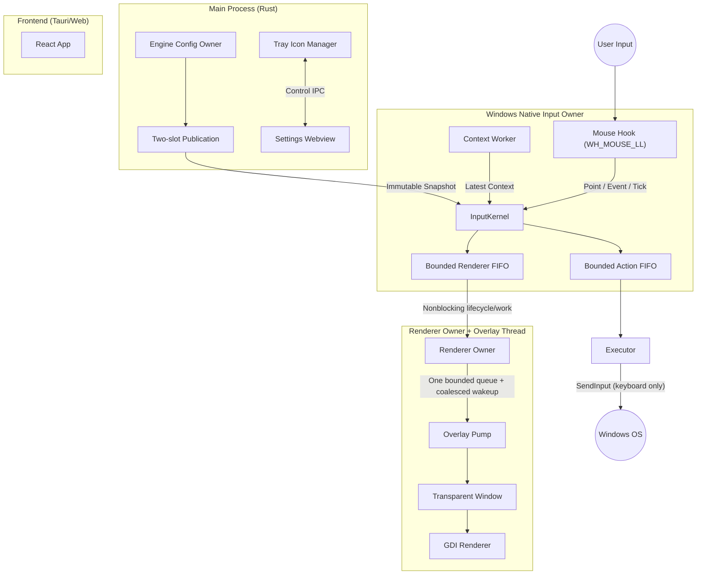

# Zero Gesture Architecture Design Document

> [!NOTE]
> この文書はP05aのWindows runtime shellとP04b3bまでのmacOS入力・context/action境界を説明する。
> マルチプラットフォーム目標設計と後続移行ゲートは
> [ADR index](./adr/README.md) を正とする。

## 1. Overview

Zero Gesture は、Windows専用の高性能マウスジェスチャーツールです。
**"Hybrid Native/Web Architecture"** を採用し、設定画面の柔軟性と、常駐時の極限までの軽量化・低遅延を両立させます。

### Core Philosophy

- **Zero-Latency Hook:** マウス入力の監視と遮断は、OSのネイティブAPIを直接叩き、最小限のオーバーヘッドで行う。
- **Native Rendering:** ジェスチャー軌跡（Trail）の描画にはWebviewを使用せず、現行実装はGDIで透明なオーバーレイウィンドウに直接描画する。`direct2d.rs`は常に初期化errorを返す未実装stubである。
- **On-Demand Webview:** 設定画面が必要な時のみWebviewをロードし、通常時はメモリから解放する。

---

## 2. System Diagram



---

## 3. Component Details

### 3.1. Engine Lifecycle and IPC Owner

Tauri main threadがアプリケーションのライフサイクルを管理し、専用IPC owner threadが設定mutationを単一所有します。

- **Responsibility:**
  - Tauriランタイムの初期化。
  - システムトレイ（タスクトレイ）のアイコンとメニュー管理。
  - Engine Config ownerだけが行う設定ファイルの読み書き（Disk I/O）。
  - 設定画面（Webview）の表示/非表示トグル。
  - immutable compiled configを二つの固定slotへ保持し、generation/indexをatomic publishする。Windows native input ownerはidle時にproven reader protocolでsnapshotを取得し、active gesture/action/replayの終了までgenerationをpinする。
  - durable commit/publication後もHook threadを再起動しない。Applied observerはnative ownerの生存だけを確認し、次のidle inputが新generationを読む。owner failureはdiskをrollbackせずEngine全体を終了し、次のbounded restartでcommitted truthを再読込する。
  - Tray labelはApplied後にTauri main threadへ非同期enqueueする。IPC owner threadは同期menu APIを呼ばず、tray自身の変更はApplied受信後にmain thread上でもlabelを整合する。

#### Windows runtime shell

P05aでは同一executableを二つの独立process modeとして維持する。Engineは
current-user singleton、tray、IPC、native input ownerだけを保持し、content
window/WebView2を作らない。SettingsはEngineと共存し、必要時だけ一つのWebViewを
持つ。

Settings builderだけがTauriのautostart pluginとsingle-instance pluginを登録する。
Settingsの成功したsetupは同一exeの`--engine` login起動をenableして検証する。
二つ目のSettings起動は既存processへ転送して終了し、既存windowを
show/unminimize/focusする。Settings windowを閉じるとSettings processとWebView2は
終了するが、Engine、hook、IPCは継続する。Engine trayのleft-click/Open Settingsは
同一exeを`--settings`で起動し、反復起動も一つのSettingsへ収束する。QuitはEngine
workerを停止してprocessを終了するが、login autostartを解除しない。

実HKCU、installed bundle、Explorer、installer/upgrade/reinstall/uninstall、署名は
P05cの実機gateであり、debug/CI process testはautostart登録を明示的に迂回する。
順序と非対象は[ADR 0019](./adr/0019-windows-first-runtime-shell.md)を正とする。

### 3.2. Hook Thread (The "Sensor")

UIスレッドのブロックを防ぐため、独立したスレッドでマウス入力を監視します。

- **Technology:** `windows-sys` crate (Win32 API: `SetWindowsHookExW`, `CallNextHookEx`)
- **Responsibility:**
  - **Low-Level Mouse Hook:** `WH_MOUSE_LL` を使用してマウスイベントをフック。
  - **Event Suppression:** ジェスチャー開始トリガー（例: 右クリック）を検知した場合、OSへのイベント伝播をブロック（`1`をreturn）し、コンテキストメニューの出現を防ぐ。
  - **Gesture Recognition:** マウスの移動ベクトルを計算し、定義されたジェスチャー（例: `Right` -> `Down`）と照合する。
  - **Input owner:** callbackは`MSLLHOOKSTRUCT`のpoint/event/tickを`InputKernel`へ渡し、二slot readerの固定atomic操作と固定長lane reservationだけでpass/suppressを同期決定する。allocation、lock、blocking send、IPC/JSON、log、file I/O、OS query、thread生成、Tauri/WebView callを行わない。
  - **Context Resolution:** callback外のContext workerが`GetCursorPos`、`WindowFromPoint`、window/process情報、app matchingを事前解決し、一つのlatest-value mailboxへgeneration/binding/target/point/tickを公開する。exact point、100 ms以内、same generationを満たさないtriggerはfail-openでpassする。
  - **Communication:** callbackはaction 16件、renderer 64件の独立した固定長FIFOへnumeric workだけをenqueueする。renderer point/labelはoverload時にdropできるが、callback lane、renderer-owner ingress、overlay ingressの各queueがstartからendまで一つのterminal slotを予約する。
  - **Action:** target activation、keyboard action、trigger replayは同じaction FIFOをHook Threadのmessage loopがcallback復帰後に実行する。activation resultとinjection/completion failureは`InputKernel`へ戻す。
  - **Readiness/Fatal:** Hook thread IDは`SetWindowsHookExW`とsafety timerの成功後にだけreadyとして公開する。message loopはcontext/renderer ownerの終了を継続監視し、予期しない終了ではsuppressionを解除してEngineをnonzero終了する。

### 3.2.1. macOS Event Tap Owner

macOS Engineは専用native threadでlisten-only `CGEventTap`と`CFRunLoop`を
所有する。callbackはevent内のmouse情報を既存`MouseEvent`/`Point`へ正規化し、
64件の固定SPSC queueへenqueueするだけで、常に元eventをOSへ返す。
permission拒否、tap生成失敗、disable、queue overloadはすべてfail-openである。

P04b2ではcontext、`InputKernel`、抑止/replay、action、rendererへ接続しない。
Listen Event permissionのpromptもEngineから表示せず、後続Settings UIへ委ねる。

P04b3aでは後続consumerがまだ存在しないため、run-loop ownerは正規化queueを
drainするだけでcontext workerを起動せず、Accessibility preflightやAX/process
queryを実行しない。bootstrapは未使用`ConfigSnapshotReader`をowner開始前に
解放する。crate-privateなworker/cache seamはproduction compileされ、
capacity-one coalescing、MouseMoveだけの25 ms rate limit、ButtonDown即時要求、
50 ms AX timeout、title取得前後のfocused-window `CFEqual`、PID・process
start時刻によるcache invalidationをdeterministic testで固定する。
nullable CF値、denied/error/timeout、focus/target変更、不正文字列はUnknownへ
劣化し、P04b3bが実consumerと同時にworkerを接続する。
`ForegroundWindowInfo`の既存Windows payloadは変更せず、P04b2同様の
listen-only通過を維持する。

P04b3bではrun-loop consumerが初めて`ConfigSnapshotReader`を保持し、
`ContextWorker`をproduction起動する。Event Tap callbackはresolverやexecutorを
呼ばず、foreign inputを固定queueへenqueueする。actual run-loopとbehavior testは
同じcrate-private drain leafを使い、そのleaf側だけが既存owner/runtimeから
context必要性を判定してconsumerを呼ぶ。
enabledかつbindingありの場合に限りMouseMoveを25 ms rate limitでobserveし、
ButtonDownは該当trigger bindingがある場合だけ即時observeする。ButtonUp、
wheel、無関係なButtonDownはqueryを起こさずcacheだけを保持する。disabled、
bindingless、config unavailableへの遷移ではsnapshotをUnknownへinvalidateする。
requestはownerが発行する単調`u64` idをmailbox、resolver、snapshotへ保持し、
不要遷移時の最終idより新しい結果だけを再受理するため、同一tickの遅延結果や
`u32` tick wrapでは再有効化後のUnknownを解除できない。
exact pointかつ100 ms以内のsnapshotだけを`NativeInputOwner`へ渡し、
Unknown/stale/wrong generationではgesture/actionを開始しない。

同じrun-loopは既存`InputKernel`のactivation-before-dispatchとgeneration pinを
再利用し、actionを8件bounded FIFOで専用`macos-action` workerへnonblocking
送信する。workerは明確なmacOS key codeを持つ`Action::Keyboard`だけを、
configured key-down順・逆key-up順でCGEvent生成し、全eventへprocess-instance
markerを設定して`CGEventPost`する。callbackはraw event field読取の前に
`kCGEventSourceUserData`の単一整数比較を行い、同markerをqueueへ入れない。
markerはtap install前に生成し、restartごとに変わる。

Event Tapはlisten-onlyのままで、kernelのSuppress結果、Replay、renderer effectは
P04b3bではOSへ適用しない。mailbox満杯、context/permission喪失、unsupported
key、NULL生成、worker停止はactionをdrop/fail-openし、物理inputを待たせない。
active suppression、mouse replay、target再検証/activation、native overlayは
P04b3cへdeferする。

### 3.3. Overlay Thread (The "Visuals")

TauriのWindow機能を使わず、Rustから直接Win32ウィンドウを作成・制御します。

- **Technology:** `windows-sys` crate (Win32 API, GDI)
- **Responsibility:**
  - **Window Creation:** `WS_EX_LAYERED | WS_EX_TRANSPARENT | WS_EX_TOOLWINDOW` スタイルの全画面透明ウィンドウを作成。
  - **Rendering:** Hook Threadから送られてくる座標データを元に、GDI（`Polyline` + バックバッファビットマップ）を用いてラインを描画する。移行でもGDIを維持し、別rendererの採用は性能契約の未達を測定した後に別ADRで判断する。Direct2Dは未実装（常にerrorを返すstubのみ）。
  - **Lifecycle:** ジェスチャー中のみ可視化（`ShowWindow`）し、終了後は非表示＆描画クリアを行う。Hook pumpはrenderer ownerへnonblocking enqueueするだけで、overlayの起動・generation置換・joinはrenderer owner側で行う。
  - **Delivery:** overlay commandは一つの64件bounded queueにpump消費まで保持し、payloadを別のWin32 message queueへ移さない。`PostThreadMessageW`はcoalesced wakeupだけを運び、失敗時もsafety timerが同じqueueをdrainする。renderer-ownerとoverlayへの両downstream queueもterminal slotを予約する。point/labelはoverload時にdrop可能だが、terminal失敗とworker終了はowner/kernelへfaultとして戻す。非同期renderer終了時は未実行actionを破棄し、kernelのReplay/Cancelをbounded action laneで完了してからfatal teardownする。

### 3.4. Settings UI (The "Interface")

ユーザーがジェスチャー定義を編集するための画面です。

- **Technology:** Tauri Frontend (React 19 + Tailwind CSS v4 + react-aria-components + TanStack Router)
- **Responsibility:**
  - ジェスチャーとアクションのマッピング編集。
  - 軌跡の色・太さの設定。
  - Tauri Commandを経由してRust側の設定ファイルを更新。
  - edit/import開始時にEngineから観測したrevisionを保持し、Prepareへ渡す。Applied後は返されたconfig/revisionでquery cacheを置換し、Windows metadata durability warningを表示する。
  - **Performance Note:** この画面が開いていない時、Webviewプロセスは存在しないか、サスペンド状態になるように管理する。

---

## 4. Data Flow

### Scenario: User performs "Right-Drag Down" (Minimize Window)

1.  **Trigger:** ユーザーが右ボタンを押下 (`WM_RBUTTONDOWN`)。
2.  **Intercept:** **Hook Thread** がイベントを検知。設定に基づき、イベントをOSに渡さずに握りつぶす。
3.  **Start:** ジェスチャーモードに移行。**Overlay Thread** に「表示開始」シグナルを送信。
4.  **Tracking:** ユーザーがマウスを下に移動。
    - **Hook Thread** は座標をサンプリングし、ジェスチャー方向「Down」を判定。
    - 同時に座標を **Overlay Thread** へ送信。
5.  **Rendering:** **Overlay Thread** が受信した座標を元に、画面上に線をリアルタイム描画。
6.  **Release:** ユーザーが右ボタンを離す (`WM_RBUTTONUP`)。
7.  **Execution:**
    - **Hook Thread** がジェスチャー完了を検知。
    - 「Down」に対応するアクション（`Win+Down` キー送信など）を実行。
    - **Overlay Thread** に「終了」シグナルを送信。
8.  **Cleanup:** オーバーレイが消去され、ウィンドウが非表示になる。

---

## 5. Technology Stack & Crates

| Category             | Technology / Crate                 | Purpose                                          |
| :------------------- | :--------------------------------- | :----------------------------------------------- |
| **App Framework**    | `tauri` v2                         | アプリケーションシェル、設定UI、ビルドシステム   |
| **Windows API**      | `windows-sys`                      | Win32 APIへのRawアクセス (Hooks, GDI, Input)     |
| **macOS Input**      | Core Graphics / Core Foundation FFI | listen-only Event Tapとrun-loop ownership       |
| **macOS Context**    | AppKit / Accessibility FFI          | frontmost appとfocused windowのbounded worker解決 |
| **Concurrency**      | `std::thread`, `crossbeam-channel` | スレッド管理と高速なメッセージパッシング         |
| **State Mngt**       | Engine owner + fixed two-slot publication | 設定mutationの単一所有とlock-free snapshot read |
| **Serialization**    | `serde`, `serde_json`              | 設定ファイルの保存・読み込み                     |
| **Logging**          | `log`, `tauri-plugin-log`          | ログ出力                                         |
| **Input Simulation** | `windows-sys` (SendInput)          | キーボード・マウス操作の自動実行                 |
| **Pattern Matching** | `regex`                            | アプリ名マッチング                               |
| **Frontend**         | React 19 + TypeScript + TanStack Router + react-aria-components | 設定画面のUI構築 |

---

## 6. Directory Structure

```text
/
├── src-tauri/
│   ├── src/
│   │   ├── main.rs             // Entry point, Tauri setup
│   │   ├── lib.rs              // WorkerThreads管理、スレッド起動
│   │   ├── config/             // schema v2、legacy migration、immutable compile
│   │   ├── commands.rs         // Tauri IPC コマンドハンドラ
│   │   ├── executor.rs         // Windowsアクション実行 (SendInput)
│   │   ├── executor/
│   │   │   └── macos.rs       // bounded tagged CGEvent keyboard worker
│   │   ├── hook/
│   │   │   ├── owner.rs       // InputKernel、config pin、固定action/renderer lane
│   │   │   ├── macos.rs       // listen-only CGEventTapとrun-loop consumer
│   │   │   ├── macos_context.rs // bounded AX context worker/cache
│   │   │   └── win32.rs       // WH_MOUSE_LL、context worker、owner message loop
│   │   ├── domain/
│   │   │   ├── mod.rs         // portable gesture module interface
│   │   │   ├── recognition.rs // ジェスチャー方向計算
│   │   │   └── session.rs     // session stateとclosed decision/effect
│   │   ├── tray.rs             // システムトレイ管理
│   │   ├── capture.rs          // ウィンドウキャプチャ
│   │   ├── window_info.rs      // アクティブウィンドウ情報取得
│   │   ├── log.rs              // ログ設定
│   │   └── overlay/
│   │       ├── mod.rs          // TrailRendererトレイト、OverlayCommand定義
│   │       ├── window.rs       // Win32ウィンドウ作成・メッセージループ
│   │       ├── gdi.rs          // GDIレンダラー実装
│   │       └── direct2d.rs     // Direct2Dレンダラー（未実装スタブ）
│   ├── Cargo.toml
│   └── build.rs
├── src/                        // Frontend (Settings UI)
│   ├── main.tsx
│   ├── routes/                 // TanStack Router ファイルベースルーティング
│   └── components/
└── docs/
    └── architecture.md
```

## 7. Performance Considerations

- **Blocking:** 現行Hook callbackはnormalize/evaluate、fixed atomic snapshot/context read、fixed-capacity lane reserve、coalesced nonblocking wakeup、pass/suppress returnに限定する。OS context query、activation/action実行、renderer lifecycle/joinはcallbackとHook pumpの外へ分離済みである。
- **macOS fail-open:** Event Tap callbackはself markerの単一整数比較、event fieldの正規化、固定SPSC enqueue、atomic KPIだけを行う。context queryとaction postingはowner drain後の各専用workerだけが行い、permission/timeout/cache/mailbox/生成/worker失敗でも入力はlisten-onlyで通過する。
- **Memory Safety:** `unsafe` ブロックを多用するWin32 API部分は、Rustのラッパー関数で適切に抽象化し、メモリリークや未定義動作を防ぐ。
- **Drawing:** 現在とWindows移行中はGDI（`Polyline` + バックバッファ）を使用する。`direct2d.rs`は未実装stubであり、性能契約の未達を測定した場合だけ別ADR/PRでrenderer変更を検討する。macOSのAppKit/Core Animation adapterはこのWindows判断と分離する。
