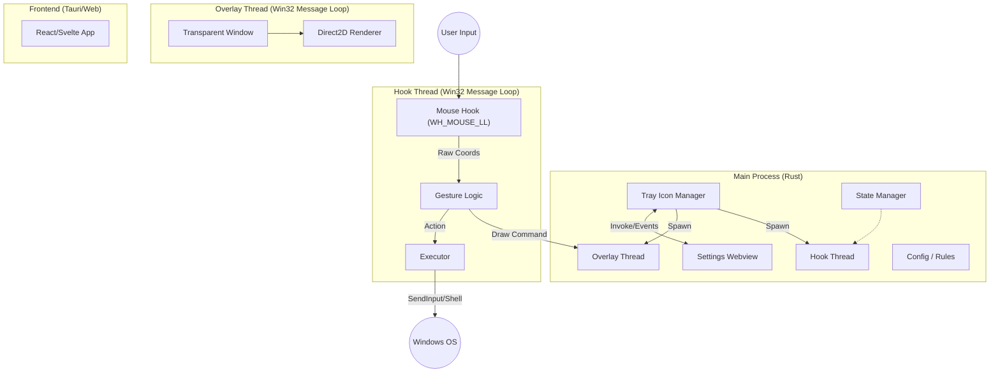

# Zero Gesture Architecture Design Document

## 1. Overview

Zero Gesture は、Windows専用の高性能マウスジェスチャーツールです。
**"Hybrid Native/Web Architecture"** を採用し、設定画面の柔軟性と、常駐時の極限までの軽量化・低遅延を両立させます。

### Core Philosophy

- **Zero-Latency Hook:** マウス入力の監視と遮断は、OSのネイティブAPIを直接叩き、最小限のオーバーヘッドで行う。
- **Native Rendering:** ジェスチャー軌跡（Trail）の描画にはWebviewを使用せず、Direct2D/GDIを用いて透明なオーバーレイウィンドウに直接描画する。
- **On-Demand Webview:** 設定画面が必要な時のみWebviewをロードし、通常時はメモリから解放する。

---

## 2. System Diagram



---

## 3. Component Details

### 3.1. Main Thread (Tauri Entrypoint)

アプリケーションのライフサイクルを管理します。

- **Responsibility:**
  - Tauriランタイムの初期化。
  - システムトレイ（タスクトレイ）のアイコンとメニュー管理。
  - 設定ファイルの読み書き（Disk I/O）。
  - 設定画面（Webview）の表示/非表示トグル。
  - Global State（設定データ）の保持と、各スレッドへの共有（`Arc<RwLock<Config>>`）。

### 3.2. Hook Thread (The "Sensor")

UIスレッドのブロックを防ぐため、独立したスレッドでマウス入力を監視します。

- **Technology:** `windows` crate (Win32 API: `SetWindowsHookExW`, `CallNextHookEx`)
- **Responsibility:**
  - **Low-Level Mouse Hook:** `WH_MOUSE_LL` を使用してマウスイベントをフック。
  - **Event Suppression:** ジェスチャー開始トリガー（例: 右クリック）を検知した場合、OSへのイベント伝播をブロック（`1`をreturn）し、コンテキストメニューの出現を防ぐ。
  - **Gesture Recognition:** マウスの移動ベクトルを計算し、定義されたジェスチャー（例: `Right` -> `Down`）と照合する。
  - **Communication:** \* 描画座標を `crossbeam-channel` 経由で **Overlay Thread** へ送信。
    - ジェスチャー確定時、アクション（キー送信、コマンド実行）を実行。

### 3.3. Overlay Thread (The "Visuals")

TauriのWindow機能を使わず、Rustから直接Win32ウィンドウを作成・制御します。

- **Technology:** `windows` crate (Win32 API, Direct2D/DirectComposition)
- **Responsibility:**
  - **Window Creation:** `WS_EX_LAYERED | WS_EX_TRANSPARENT | WS_EX_TOOLWINDOW` スタイルの全画面透明ウィンドウを作成。
  - **High-Performance Rendering:** Hook Threadから送られてくる座標データを元に、GPUアクセラレーション（Direct2D）を用いてラインを描画。
  - **Lifecycle:** ジェスチャー中のみ可視化（`ShowWindow`）し、終了後は非表示＆描画クリアを行うことでリソースを節約。

### 3.4. Settings UI (The "Interface")

ユーザーがジェスチャー定義を編集するための画面です。

- **Technology:** Tauri Frontend (React + Tailwind CSS + shdcn/ui)
- **Responsibility:**
  - ジェスチャーとアクションのマッピング編集。
  - 軌跡の色・太さの設定。
  - Tauri Commandを経由してRust側の設定ファイルを更新。
  - **Performance Note:** この画面が開いていない時、Webviewプロセスは存在しないか、サスペンド状態になるように管理する。

---

## 4. Data Flow

### Scenario: User performs "Right-Drag Down" (Minimize Window)

1.  **Trigger:** ユーザーが右ボタンを押下 (`WM_RBUTTONDOWN`)。
2.  **Intercept:** **Hook Thread** がイベントを検知。設定に基づき、イベントをOSに渡さずに握りつぶす。
3.  **Start:** ジェスチャーモードに移行。**Overlay Thread** に「表示開始」シグナルを送信。
4.  **Tracking:** ユーザーがマウスを下に移動。
    - **Hook Thread** は座標をサンプリングし、ジェスチャー方向「Down」を判定。
    - 同時に座標を **Overlay Thread** へ送信。
5.  **Rendering:** **Overlay Thread** が受信した座標を元に、画面上に線をリアルタイム描画。
6.  **Release:** ユーザーが右ボタンを離す (`WM_RBUTTONUP`)。
7.  **Execution:**
    - **Hook Thread** がジェスチャー完了を検知。
    - 「Down」に対応するアクション（`Win+Down` キー送信など）を実行。
    - **Overlay Thread** に「終了」シグナルを送信。
8.  **Cleanup:** オーバーレイが消去され、ウィンドウが非表示になる。

---

## 5. Technology Stack & Crates

| Category             | Technology / Crate                 | Purpose                                          |
| :------------------- | :--------------------------------- | :----------------------------------------------- |
| **App Framework**    | `tauri` v2                         | アプリケーションシェル、設定UI、ビルドシステム   |
| **Windows API**      | `windows`                          | Win32 APIへのRawアクセス (Hooks, GDI/D2D, Input) |
| **Concurrency**      | `std::thread`, `crossbeam-channel` | スレッド管理と高速なメッセージパッシング         |
| **State Mngt**       | `std::sync::{Arc, RwLock}`         | 設定データ等のスレッド間共有                     |
| **Serialization**    | `serde`, `serde_json`              | 設定ファイルの保存・読み込み                     |
| **Logging**          | `log`                              | ログ出力                                         |
| **Input Simulation** | `windows` (SendInput)              | キーボード・マウス操作の自動実行                 |
| **Frontend**         | React or Svelte + TypeScript       | 設定画面のUI構築                                 |

---

## 6. Directory Structure

```text
/
├── src-tauri/
│   ├── src/
│   │   ├── main.rs         // Entry point, Tauri setup
│   │   ├── hook.rs         // Low-level mouse hook logic
│   │   ├── overlay.rs      // Direct2D rendering window
│   │   ├── config.rs       // Structs for settings
│   │   ├── executor.rs     // Action dispatcher (Key sender)
│   │   └── tray.rs         // System tray handling
│   ├── Cargo.toml
│   ├── tauri.conf.json
│   └── capabilities/
├── src/                    // Frontend (Settings UI)
│   ├── App.tsx
│   └── components/
└── docs/
    └── architecture.md
```

## 7. Performance Considerations

- **Blocking:** Hookプロシージャ内での重い処理は厳禁。座標計算とチャネル送信のみを行い、即座に `CallNextHookEx` またはリターンを行う。
- **Memory Safety:** `unsafe` ブロックを多用するWin32 API部分は、Rustのラッパー関数で適切に抽象化し、メモリリークや未定義動作を防ぐ。
- **Drawing:** GDIではなくDirect2Dを使用することで、CPU使用率を下げ、高DPI環境での描画品質を保つ。
